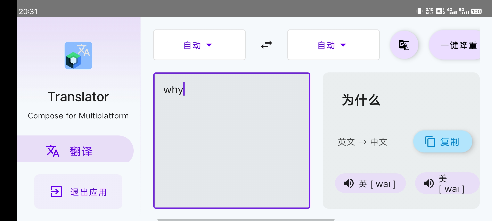
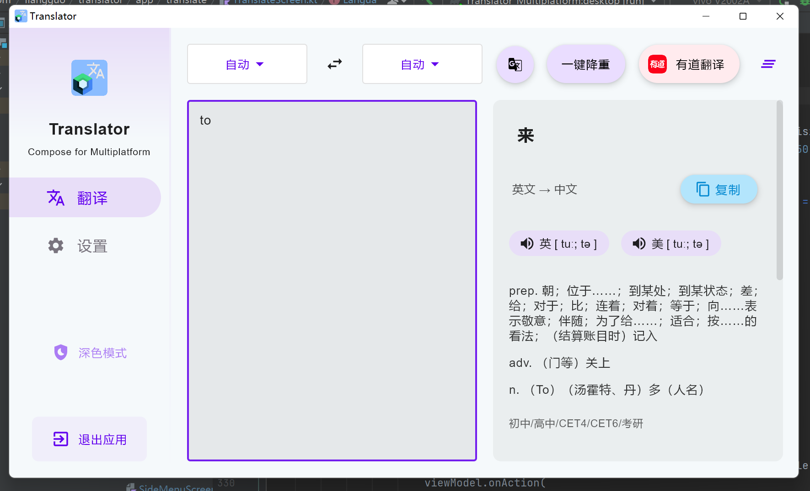

    <h1>Translator for Multiplatform Compose</h1>

### 中文 | [English](README-en.md)

国内Gitee地址：https://gitee.com/liang_dh/Translator-Compose-Multiplatform

#### 一个简简单单的跨平台翻译小软件，内置了百度翻译和有道翻译的接口，除简单的翻译之外还有降重的功能。
- **极致的启动速度🚀** 没有任何广告，没有任何后台服务，即开即用，不再需要小心翼翼的点击”跳过广告“然后还要等主界面卡半天才能用。
- **大学牲落泪的一键降重功能😊** 只需按钮轻轻一点，就能得到一段文字的另一种写法，降重时翻译几次由您自己决定！查重率分分钟降至10%！
- **精简的界面**，前沿的技术，让Material Design风格不再只是安卓的专项。

### 技术相关
这是一个Kotlin跨平台声明式UI前端技术开发的项目，这个项目包含的目标平台是Android和Desktop。
前端页面主要是由Jetpack Compose 和 Compose for Desktop 实现。
网络请求相关模块由Ktor客户端 和 KotlinSerialize实现。
软件架构上采用 Jetpack Compose 官方推荐的MVI架构。
- Compose跨平台 - [Compose Multiplatform](https://www.jetbrains.com/lp/compose-mpp/)
- Android - [Jetpack Compose](https://developer.android.com/jetpack/compose)
- Desktop - [Compose for Desktop](https://www.jetbrains.com/lp/compose-desktop/)
- 网络请求 - [Ktor Client](https://ktor.io/)

## 开发环境
- 开发工具： IntelliJ IDEA (2022.2.1) / Android Studio (Chipmunk)
- Gradle JVM Version: 11
- 项目SDK: Java 17 (Oracle OpenJdk version 17.0.4)

## 已知的问题
- 打包电脑端程序时，需要把 gradle jvm 的版本更改到15以上，并且在 gradle.properties 文件中删除 org.gradle.jvmargs=...，这样换来换去很麻烦，待改进。
- 程序在电脑端运行时，如果安装在默认的 C:/Program Files/ 中，文件系统会失效，你可以把文件复制到其他目录中然后点击exe启动。

## 下载体验
- Android  [点击此处下载](release/android-debug.apk)
- Windows x64 解压即用 [点击此处下载](release/win-x64%20解压即用.zip)
- Windows x64 安装程序（不建议用这个，因为安装到C盘下文件系统会出问题） [点击此处下载](release/win-x64%20安装程序，建议去下另一个.msi)

## 演示

### Android 平台

|         点击进行翻译          |        利用翻译一键降重         |
|:-----------------------:|:-----------------------:|
|  |  |

|          切换翻译引擎/语言          |       相关设置以及丰富的动画       |
|:---------------------------:|:-----------------------:|
|  |  |

#### Android设备上的横屏显示

### 电脑平台

## 使用提醒
1.首次使用需要先配置翻译接口的”AppId“和”AppSecret“，如果不知道可以去官网注册并创建应用，普通翻译接口都是免费的。点击此处 [有道智云](https://ai.youdao.com/) 和 [百度翻译开放平台](http://api.fanyi.baidu.com/) 。

2.“一键降重”功能其实就是把一段文字翻译成其他几种语言最后再翻译回中文，结果可能狗屁不通顺，自己得多检查一下。

3.电脑端会根据窗口大小、安卓端会根据横竖屏来自动调整使用横向布局还是竖向布局，如果不想要自动调整，可以在设置里指定使用哪一种屏幕布局。

### 最后闲谈吹牛瞎扯淡一下
kotlin太棒了，一套语言几乎可以完成任何事情，一个ktor解决后端+客户端。
现在的compose跨平台技术正在让kotlin走出安卓，在其他的平台上也能做客户端的开发。
并且前端和逻辑也是同一种语言，不再像传统安卓需要用java和xml相互配合。
 
 
作为一门jvm语言，kotlin可以说和java完全兼容，过去几十年来人们建立起的一套java生态在当今kotlin的时代来临之后依旧没有废弃。
 
 
compose和flutter很像，这两者都是谷歌研发出来的框架，甚至compose是由flutter研发团队和Android团队共同研发出来的，这两种前端框架各有特色，我还是很看好kotlin，似乎这门语言是万能的一样。
 
 
开发的过程中还一边写了点日记，无聊的话可以[点进去看一看](docs/diary.md)

[//]: # (## 好心人v我50)

[//]: # (如果你觉得我帮助到了你，可以给我一点鼓励，感谢老板！（打赏时可以附上自己的大名和Github地址），金额随意，以表支持。)

[//]: # ()
[//]: # (![]&#40;images/pay.jpg&#41;)

[//]: # ()
[//]: # (| 赞助者 | 主页                          |)

[//]: # (|-----|-----------------------------|)

[//]: # (| ldh | https://github.com/ldh-star |)

## 联系方式

Email: liang.dh@outlook.com

QQ: 2637614077

## License

    Copyright 2021 Clément Beffa
    
    Licensed under the Apache License, Version 2.0 (the "License");
    you may not use this file except in compliance with the License.
    You may obtain a copy of the License at
    
       http://www.apache.org/licenses/LICENSE-2.0
    
    Unless required by applicable law or agreed to in writing, software
    distributed under the License is distributed on an "AS IS" BASIS,
    WITHOUT WARRANTIES OR CONDITIONS OF ANY KIND, either express or implied.
    See the License for the specific language governing permissions and
    limitations under the License.