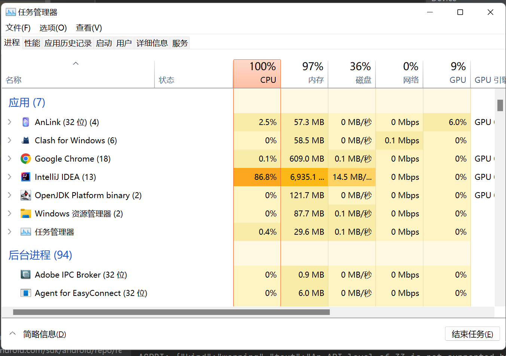

<div align=center>
    <h1>Translator for Multiplatform Compose</h1>
</div>

## 2022年10月24日
该项目的前身是一个 Compose for Desktop 的项目，专门方便我在电脑上做翻译。
现在决定新开一个坑，把这个项目做成跨平台的，现在的目标是先做到 Desktop 和 Android 共用同一套代码。

#### 混合编译的时候遇到了好多问题啊
- 图片资源 在android中，读取图片资源是通过R.xxx.xxx来定位， painterResource(Int)传入的是图片资源的id，而desktop项目中所有资源是放在resource文件夹下的，定位直接用路径字符串，这两个会冲突。我暂时没有管怎么去解决冲突，而是导入了包icons-extended，用官方的包里的ImageVector。
- Desktop组件不能编译到安卓中 有一些组件是desktop特有的，比如Tooltip:鼠标放上去才会显示的组件。比如滑动条等等。这种问题可以只能安卓和desktop各写一个组件了，比如在这个组件中安卓是直接显示内容，而desktop端是显示内容加滑动条。
- 不知道的引用 有的模块里写不会自动导包进去（比如 common/androidMain 模块），不知道是bug还是什么，所以编译的时候会报错： The following declaration is incompatible because parameter types are different... 解决方式：手动把包导进去。
- 乱导包导致报错 在安卓编译时，发现如下报错：Duplicate class androidx.compose.ui.graphics.BlendMode found in modules ui-graphics-1.2.1-runtime (androidx.compose.ui:ui-graphics:1.2.1) and ui-graphics-desktop-1.2.0 (org.jetbrains.compose.ui:ui-graphics-desktop:1.2.0)，经过仔细检查后发现，原来是误将desktop端的依赖导入进整个项目的公共依赖里边去了，把desktop的依赖单独放在desktop的以来模块里即可。


总之，混合之后才发现需要解决的问题太多了，要包容不同平台的差异性，不过我认为这一项技术也有他自己的优点：
1. 前端和逻辑全部使用kotlin代码，真正实现一套代码多端复用。
2. 相比于flutter使用的dart语言，kotlin作为jvm语言有更好的生态，再java的基础上kotlin的语法和功能真的强大太多了。

电脑承受了它这个年纪不该承受的压力



## 2022年10月25日
这个项目一直报错
Caused by: java.lang.OutOfMemoryError: Java heap space
初步原因已经找到了，是导入了material-icons-extended这个库后会导致无法打包安卓。


17点31分： 嗨害嗨，终于解决啦。报错的原因是在导入图标拓展包时，编译安卓端会导致java堆内存不足，编译就会失败。

解决办法：在gradle.properties文件中加入以下代码修改内存大小 
```
org.gradle.jvmargs=-Xmx4096m -XX:MaxPermSize=2048m -XX:+HeapDumpOnOutOfMemoryError -Dfile.encoding=UTF-8
```

一个一个依赖去排查，搞了一天多才搞出来，各种方法都试完了，终于弄出来了！！！呜呜呜~

最后这个项目的配置如下：
- 安卓sdk 33
- 项目jdk 17.0.4
- gradle(默认) jvm 11.0.16

## 2022年10月26日

为了解决安卓和desktop上的ui差异问题，我将组件进行了细分。并且在数据状态中新增了isLandscape变量，由这个变量来决定使用什么布局。

#### 19点51分
    之前很头疼的一个问题终于解决了！！~
- 如何显示资源文件中的图片？
参考了官方的代码，将需要跨平台的资源文件用一个类似于安卓中R.java文件的写法定义出来:
```
object Res {
    object drawable {
        val icon_baidu = "drawable-nodpi/icon_baidu.png"
        val icon_youdao = "drawable-nodpi/icon_youdao.png"
    }
}
```
在电脑端的资源文件中直接按目录文件位置加进去，在安卓端如何获取呢？参考了官方的写法：
```
private fun drawableId(res: String): Int {
    val imageName = res.substringAfterLast("/").substringBeforeLast(".")
    val drawableClass = com.liangguo.common.R.drawable::class.java
    val field = drawableClass.getDeclaredField(imageName)
    return field.get(drawableClass) as Int
}
```
通过对资源名字反射的方法，把文件对应成对应id，把int值找出来。

太妙了，简直了！！！

安卓端基本也通了，并且也包含了电脑端的布局，当安卓手机切换到横屏的时候就会显示。这里我用了我自己开源的一个方向库[EasyingOrientation](https://github.com/ldh-star/EasyingOrientation)。

现在呢，我准备做本地数据持久化了，预计用File来实现，打印了手机端和电脑端的文件路径发现，安卓端的文件相对位置是从根目录开始算起，而电脑端的是
D:\Code Project\IdeaProject\Compose Multiplatform\Translator_Multiplatform\desktop\
从这个目录开始算起，有点奇怪。。。
这个问题还得想办法解决一下。
然后还得想一想做一套用户偏好系统，就用File去做，我得想想该怎么实现，现在已经是22点40分了，这些问题留到明天再说吧，再去力扣刷一道题就回去睡觉咯。


## 2022年10月27日

本地数据持久化算是做出来了，并且还开源了做成了一个依赖[KtPref](https://gitee.com/liang_dh/KtPref)。
基于java的文件系统来实现的。

电脑端打包的时候遇到了异常，要求gradle的jre环境版本在15以上，于是我将gradle的jre环境设置到了17，结果一运行又发现出问题了。
之前配置的修改gradle运行时jvm内存大小的配置跑不通了，于是又只能注释掉那行。

所以现在情况就是：在跑安卓的时候设置gradle的jre环境11，加上改内存的配置代码。在打包电脑程序的时候，gradle设置回17，注释掉加内存那行代码。

#### 讲一讲又新加了哪些东西。
- 新加了一个侧边栏菜单，在横屏和竖屏上有两种显示，竖屏的显示是侧滑栏来实现的。
- 主题切换已经实现了，并且改进了对其本地化储存的方式，以密封类作为设置项的枚举，以类名作为储存的内容和具体文件。
- 新增了控制按钮，用于方便调试。

今天就到这吧，现在是22点44分了，再写一道力扣就走咯。

## 2022年10月28日
今天本来想把几个模块的分页写了，但是compose multiplatform好像不支持安卓里的navigation。
哎，只能用状态来切换页面了呗。

今天又犯了一个低级错误，在编写ApiConfig.kt文件时，对于flow的collect我居然把几个collect函数放在了同一个协程launch块中，
collect函数会持续的收集flow的数据，所以会在协程中一直阻塞，这样一来就会导致只有第一个collect函数库能够响应，后面的几个都会失效。
我居然因为这个低级错误排查了半天是哪里的问题，差点还以为是我写的KtPref库有问题，害。

翻译接口配置功能已经写好了，23点45分了，提交一下代码就收工！

## 2022年10月29日
今天打包release包的时候又出问题了,不知道为啥。

现在又遇到了一个问题，Setting中的screenOrientation，在本类里边可以collect到，但是在ViewModel里面collect不到，感觉很奇怪，今天就到这里吧，明天再看看。

## 2022年10月30日
今天把这个屏幕切换的模块做好了，电脑端遇到了一个问题，在compose界面构造完成之前，如果对MutableState进行修改的时候，就会报错，这里也没太管，加了个try就完事了。
安卓的屏幕旋转重新弄好了，现在不是根据屏幕方向的重力响应来确定横屏还是竖屏，而是直接在Activity的onCreate的时候去设置，因为当进行横竖屏切换的时候Activity会经历onDestroy到重新onCreate。

## 2022年10月31日
今天在YouTube上看了大神的compose视频，又学到了一个新技巧：创建LocalProvider，像使用LocalContext.current一样。我们可以用这种方式去自定义我们主题里的一些内容，比如间距，然后可以用这个实现在跨平台上的一些尺寸的差异性。

今天还了解了一下compose性能优化相关的问题，
由于 ScopeUpdateScope 取决于我们对 State 的读取位置，因此，这就决定了我们可以使用 Kotlin 函数式编程当中的 Laziness 思想，对 Compose 进行「性能优化」。也就是让: 状态读取与使用位置一致，尽可能缩小「重组作用域」，尽可能避免「重组」发生。

#### 到此，这个项目也算是开发的差不多啦，功能基本都能用了，跨平台差不多撮合了一周。似乎也是感受到了compose这门技术似乎正在慢慢变成另一个flutter，不过相比于flutter，我更喜欢compose，kotlin这门语言真的很顶！！！

